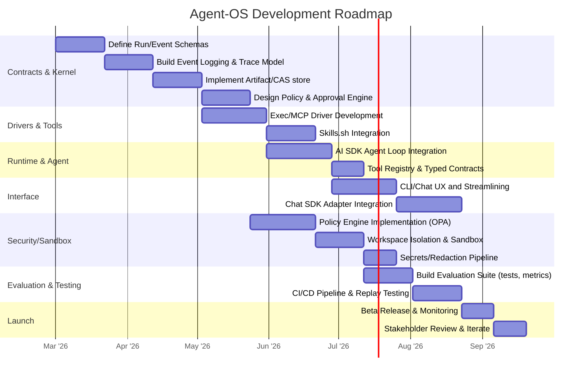

# Executive Summary

We propose an **“Agent OS”** template built on a TurboRepo monorepo, using a Bun-powered CLI and Vercel’s AI SDK (ToolLoopAgent) as the agent runtime, with standardized interfaces for tools (MCP), inter-agent communication (A2A), skills (skills.sh), and chat UIs (Chat SDK).  The core **“kernel”** provides: a **Run/Task envelope and event log**, a **content-addressed artifact store**, a **policy/authorization engine** (OPA-style), a **sandboxed workspace manager**, and an **internal scheduler/queue**.  **Drivers** implement capabilities via (1) local CLI wrappers (spawned via Bun) and (2) MCP clients.  **Apps** include the CLI agent and a chat interface via Chat SDK.  This design ensures **reproducibility** (everything logged & replayable), **safety** (capability-based security, approvals), and **modularity** (typed contracts, extensibility via Skills/MCP/A2A). 

Key points:

- **Typed Protocols:** We use MCP for structured tool calls (JSON-RPC with JSON Schema)【30†L90-L98】 and design our own Run Envelope/events schema.  Skills.sh provides versioned, discoverable actions (shell commands with input/output schemas)【10†L263-L270】【10†L297-L302】.  A2A (Agent2Agent) is noted for future multi-agent tasks, defining “Agent Cards” and structured Task lifecycles【8†L231-L239】.  
- **Kernel Components:** First-class artifacts (content-hash `artifact://` URIs), an append-only event log (`run_id`, `tool_called`, `tool_result`, etc.), a policy engine (scoped privileges + explicit approvals)【26†L263-L270】, and isolated workspaces for transactional edits.  OPA-inspired “policy-as-code” gates (approve push/deletions, network egress) prevent unsafe actions【26†L263-L270】.  
- **Execution & Scheduling:** An internal scheduler/queue handles cron or user-triggered runs (via CLI or Chat).  We **do not use Slack as a scheduler**; Slack (via Chat SDK) only **triggers/observes** runs.  Runs emit structured events (SSE/WebSocket) and audit logs (with OpenTelemetry traces) for full observability【26†L263-L270】【28†L12-L19】.  
- **Evaluation:** Each “self-improve” run includes an eval suite (tests/lint/metrics) forming a fitness function.  Improvements are only promoted if they pass all gates.  The entire run (plan, patch, tool calls, results) is saved so `agent replay <run_id>` deterministically reproduces it (no “it worked on my laptop”).  

This architecture follows industry best practices (e.g. [26], [28]): **auditability** by design (logs, traces, approvals), **least-privilege execution** (short-lived sandboxes, OPA)【26†L263-L270】, and **structured interoperability** (MCP/A2A/Skills for composability)【10†L263-L270】【8†L231-L239】.  Below we detail components, data flows, schemas, and a roadmap to make this template a robust, reusable asset for building agent-based systems.

## Architecture Overview

The system is layered as follows:

- **Kernel (Core Substrate):** Manages **Run Envelopes & Event Log**, **Artifacts** (content-addressed store), **Policy Engine**, **Workspace/Sandbox Manager**, and **Scheduler/Task Queue**.  It provides APIs (or interfaces) for storing/retrieving artifacts, emitting events, checking permissions, and managing isolated workspaces.  
- **Drivers/Adapters:** Implement concrete capabilities. For example, an **ExecDriver** spawns processes (`Bun.spawn`) and normalizes their outputs; an **MCP Driver** talks to MCP servers (JSON-RPC).  In the future, an **A2A Driver** could send/receive structured agent-to-agent messages.  Drivers know how to deal with authentication (using local creds or tokens) and how to present results to the kernel.  
- **Runtime (Agent Core):** The Vercel AI SDK’s **ToolLoopAgent** orchestrates the agent’s reasoning loop: planning steps, invoking tools (via drivers), processing results, and updating state.  It uses the Run Envelope to tag all actions, and it emits progress/events to the kernel.  The agent runtime also integrates the Skills.sh registry so that skills (shell commands) appear as tools it can call【10†L263-L270】.  
- **Apps (Interfaces):**  
  - **CLI Agent:** A Bun-based CLI that the developer runs on their machine.  It sets up the Run Envelope (including which repo to operate on, policy profile, budgets, etc.), invokes the agent runtime, and streams logs to the console.  
  - **Chat UI (Slack/Discord/etc):** Using Vercel’s Chat SDK, users can interact with the agent via chat.  Chat SDK handles platform webhooks/adapters and state; it receives user commands (e.g. `/agent self-improve`) and forwards them to the agent kernel as run requests, then streams back messages, cards, and buttons.  (Internally, Chat SDK maps a Slack thread to a `run_id` and relays updates).  

```mermaid
flowchart LR
    subgraph Kernel
        ART[Artifact Store]
        LOG[Event Log]
        POL[Policy Engine]
        WSP[Workspace Manager]
        SCH[Scheduler]
    end
    subgraph Drivers
        CMD["CLI/Exec Driver"]
        MCP["MCP Driver"]
    end
    subgraph Runtime
        AGENT["AI SDK Agent"]
    end
    subgraph Apps
        CLI[CLI Interface]
        CHAT[Chat (Slack/Discord) Interface]
    end

    CLI --> AGENT
    CHAT --> AGENT
    AGENT --> CMD
    AGENT --> MCP
    CMD --> ART
    CMD --> LOG
    MCP --> LOG
    POL --> LOG
    SCH --> LOG
    ART --> LOG
```

**Data Flow:**  A user triggers a run (via CLI or chat). The kernel creates a new **Run Envelope** (with `run_id`, objectives, policy profile, etc.) and logs `run.started`. The agent (Runtime) begins the ToolLoopAgent sequence: it diagnoses issues, plans an action, and calls tools. Each tool call (via CMD or MCP) emits events (`tool_called`, `tool_result`) into the log. Any output files are written to the workspace and then captured as `artifact://` URIs. After implementation, the agent runs validation (tests/lint) and records results. Finally, it emits `run.completed` or `run.failed`. Throughout, the policy engine may emit `policy.decide` events when gating actions. All results are stored so the run is fully replayable.

### Deployment Model: Local vs Managed

- **Local-First (Developer Machine):**  The CLI runs on a dev laptop or dedicated host. It can *natively* access the filesystem, local tools, user credentials (`git`, `gh`, `gcloud` auth, etc.), and environment. Isolation can be via separate directories or light containers. This simplifies auth (no secret distribution) but puts more trust in the local setup.  
- **Managed/Cloud:**  The agent runs in a sandboxed environment (container or VM). Here we must explicitly manage secrets (inject tokens or use a secrets vault), expose (or mount) the code repository, and run tools in containers. The kernel’s isolation is stricter (e.g. Docker sandbox), and we need a distributed scheduler/database. On the plus side, it’s multi-tenant-friendly and can scale/coordinate multiple agents (via A2A).  

**Tradeoff:** Local mode is simpler to iterate (dev tooling works out-of-box), but harder to secure and share. Managed mode is production-ready (fine-grained access, auditing), but requires building the “kernel” infrastructure (queues, vaults, K8s etc.). Our template can target local first, with hooks to scale out later.

## Protocols & Standards

- **MCP (Model Context Protocol):** We use MCP for **structured tool/data access**【30†L90-L98】. An MCP server (or multiple) registers tools and resources (via JSON Schemas). Our drivers can call `tools/list` and `tools/call` as JSON-RPC. For example, an MCP tool might fetch documentation or cloud inventory. Tools have typed inputs/outputs, making calls deterministic and validated【30†L90-L98】. We also support `resources/open/read` for LLMs. MCP yields composability: the same skill can drive local CLI or talk to remote data via MCP.

- **A2A (Agent2Agent):** Though initially optional, A2A allows **agent-to-agent** tasks【8†L231-L239】. In our vision, each agent could be a “service” that advertises an **Agent Card** (capabilities, auth scopes). A Task object (with lifecycle) and “parts” (rich content) let agents delegate subtasks. We’d support `a2a.call(agentId, task)` and streaming progress. For now, we rely on our own scheduler and single-agent runs, but we design the envelope/events so that future multi-agent orchestration via A2A could plug in cleanly【8†L231-L239】.

- **Skills.sh (Agent Skills):** Skills provide a **packaging format** for reusable actions【10†L263-L270】【10†L297-L302】. We integrate `skills.sh` so that commonly needed commands (e.g. “search codebase”, “run tests”, “format code”) are defined by simple manifests. Skills run as shell commands but declare their inputs/outputs, making them audit-friendly【10†L263-L270】. This solves “what tools can the agent invoke” via a registry. In our agent, the tool registry will include both bundled drivers and installed skills (using the `npx skills` registry).

- **Chat SDK:** Vercel’s Chat SDK provides the **multi-platform chat interface**【14†L50-L59】. It abstracts Slack/Teams/Discord/etc behind a unified API. We use it to map chat events (`thread.onNewMention`, slash commands, button clicks) into agent actions. Chat SDK natively supports streaming LLM replies into threads【14†L68-L70】, interactive cards/buttons, and pluggable state (Redis). In our architecture, Chat SDK is the *front-end adapter* – it feeds user commands into the agent (via our CLI/App) and relays back progress (e.g. “Tests passing ✅” or approval buttons).

## Run Envelope & Event Schema

Every **run** is identified by a unique `run_id` (UUID). The **Run Envelope** (sent at start) contains metadata such as:

```json
{
  "run_id": "uuid",
  "parent_run_id": null,
  "agent_id": "cli-agent@1.0",
  "base_ref": "main",
  "repo_path": "repo://<project>",
  "objective": "Improve test coverage",
  "policy_profile": "ci_safe",
  "budgets": {"max_time_ms":3600000, "max_tokens":10000},
  "timestamp": "2026-02-24T12:34:56Z"
}
```

Key fields: `repo_path` points to the workspace snapshot, `policy_profile` selects allowed scopes, and `budgets` constrain runtime costs.  All tool calls/events during the run include this `run_id`. 

The **Event Log** is an append-only stream of objects. Core event types include (high-level):

- `run.started` (envelope metadata)
- `tool.called` (timestamped, with tool name and args)
- `tool.result` (with output content or error code)
- `artifact.created` (URI of new file/data)
- `policy.decision` (allowed/blocked with reason)
- `user.approval` (when a human approves a request)
- `run.completed` / `run.failed` (with summary)
- (Later) `a2a.task` events for cross-agent calls.

Each event has timestamps, the `run_id`, an incremental `step_id`, and any relevant IDs (e.g. `tool_call_id`). For example:

```json
{"run_id":"...", "event":"tool.called", "tool":"repo.diff", "args":{"from":"main","to":"workspace"}, "timestamp":"..."}
{"run_id":"...", "event":"tool.result", "tool":"repo.diff", "result":"artifact://sha256/abcd1234", "exit_code":0}
```

This scheme ensures **complete provenance**: you can replay the run by feeding these events in order. We will publish the JSON Schema definitions for Run and Event envelopes (versioned with the package). These schemas enforce required fields and compatibility (old logs must still parse with new code).  

## Artifact Handles

All non-trivial outputs become **Artifacts** with content-addressed handles. We use URIs like `artifact://sha256/<hash>?path=<relative>` or specialized schemes:

- `artifact://<hash>` – raw blob from a file or stream.
- `file://<path>` – a path in the workspace (sandboxed root).
- `repo://<commit>` – a snapshot of the repo (Git commit).
- `secret://<id>` – a reference to an injected secret (never logged).
- `mcp://server/resource/<name>` – for MCP resources (if needed).
- In future `a2a://agent/task/<id>` to reference tasks/artifacts between agents.

For example, after running a code formatter on the workspace, we might produce `artifact://sha256/abc123?...` representing the unified diff. The Event `artifact.created` will reference this handle along with metadata (size, MIME). Handles are **immutable**: storing only a SHA256 and content pointer. The artifact store (FS or S3) deduplicates by hash. This ensures we never “paste raw blobs in chat” – instead we share handles which can be fetched if needed.

*Example schema snippet (draft)*:
```jsonc
"ArtifactHandle": {
  "type": "string",
  "pattern": "^artifact://[a-f0-9]{64}$"
}
```
Additional fields (in the Event) describe type/size. Using handles means agents can chain tasks (returning handles), not chatty text.

## Policy & Approval Model

We enforce a **capability-based security model**. Every tool or action has a declared capability (e.g. files read/write patterns, allowed network domains, allowed CLI commands). Policy profiles (e.g. `local_safe`, `ci_safe`, `release_safe`) define which capabilities are granted.  

- **Least-Privilege:** By default, no destructive action (git push, file delete outside workspace, network calls) is allowed unless explicitly permitted. For example, the CLI `fs.write` tool requires a `write` scope; if the agent’s policy profile lacks it, the attempt emits `policy.decision:DENIED`.  This is in line with the “policy-as-code with OPA” approach【26†L263-L270】.  
- **User Approvals:** Certain actions (pushing to main, publishing, network egress) trigger an approval request. An event `policy.require_approval` is emitted. In a CLI run, the agent would pause for user input. In chat, a button is posted: *“Agent requests permission to push to remote. Approve?”*. Only on `policy.user_approved` event will the action proceed. This ensures every change is accountable and human-reviewed.  
- **Transparent Logging:** Every decision (allow/deny) is logged. We include policy context (e.g. “Tool `git push` requires GitPush scope → user-approved”). This matches best-practices: “clear controls… policy as code with OPA”【26†L263-L270】 and “observability tracks every request”【28†L23-L30】.  

In summary, the policy model is pluggable (we could integrate Open Policy Agent), but by default it’s rule-based: define JSON policies in code. The key is auditability: every side-effecting operation must be **vetoed or approved explicitly**, never stealthy.

## Scheduler and Event Backbone

We distinguish user-triggered runs (via CLI or chat) from scheduled runs. 

- **Scheduler:** A separate component (or a loop in the kernel) handles time-based or CI triggers. One can configure e.g. “daily self-improve at 3am”. Each schedule creates a new Run Envelope and queues it. The scheduler also handles **concurrency** (limit N runs at once), **timeouts** (cancel if over time/budget), and **retries** for transient failures. We’ll provide a simple in-memory queue for local use, and a pluggable interface (e.g. Redis or Kubernetes Job) for production.  
- **Event Pub/Sub:** Inside the system, every event is published to an event bus. We’ll likely use an in-process emitter or Redis pub/sub. This lets multiple UIs (CLI, Chat, Web UI) subscribe to a run’s progress. For example, the Chat UI subscribes to the run’s events to stream updates in real-time, independent of the CLI process.  
- **Slack/Chat SDK:** Importantly, **Slack (via Chat SDK) is not our event store**. It is purely an interaction channel. We do not queue Slack messages as tasks. Instead: a Slack command triggers the kernel, and Slack receives event updates. No business logic or retries should rely on Slack’s delivery semantics.  

This separation ensures durability and replay: events are saved to our log (e.g. SQLite or Postgres)【28†L23-L30】. A crash or restart can replay from `run.started`. 

## Secrets and Redaction

Agent runs may use secrets (API keys, tokens). We handle them carefully:

- **Secret Handles:** Secrets are never materialized in logs. If a tool needs a secret, we pass a `secret://` handle or environment variable only to the subprocess. The kernel never logs secret values, only references (`secret://db-password`).  
- **Redaction Pipeline:** All stderr/stdout from tools is scrubbed through redaction filters before logging. We will maintain regex-based redaction rules (for common tokens) and also programmatic redaction of known env vars.  
- **Isolated Envs:** Each workspace can have a `.env` only accessible within the sandbox. We ensure tools do not accidentally echo `$HOME` or environment dumps.  

These precautions align with principle #2 (Data Privacy) from MCP【3†L169-L177】 and the “never trust unsanitized output” mindset【26†L263-L270】.  We avoid “chat log poisoning” by design.

## Workspace and Transaction Model

All code edits happen in a **workspace** isolated per run:

- At `run.started`, we snapshot the code repo (`repo://<commit>`). In local mode this might be a Git clone; in managed mode we copy files into a fresh working directory.  
- The agent works in this workspace root. Tools see only this copy (protected by path checks).  
- Changes are **atomic**: the agent never writes directly to the source repo. Instead, it stages edits and then produces a **diff artifact** (`artifact://sha256/…`). This diff is computed via a `repo.diff(workspace)` call.  
- If validation fails or policy blocks something, the workspace can simply be discarded (delete directory). No partial state persists outside artifacts.  

This transactional model (snapshot → modify → diff/publish) ensures that **rerunning the same plan always yields the same patch**. It also supports rollbacks: you can always apply the diff to the original repo. For branch-based workflows, the template can automatically create a throwaway branch for the patch.

## Deterministic Tool Wrappers

We enforce that every *tool* has a strict, deterministic contract:

- **JSON or Typed Output:** Wherever possible, tools should output JSON. We wrap CLI tools so that if they support `--json`, we use it. (Example: a `git` wrapper returns a JSON list of changed files.) Free-text output must be minimized.  
- **Exit Codes & Errors:** Tools return structured errors (`error_code`, `error_message`). The kernel assigns semantic codes (e.g. `CODE_BUILD_FAILED`, `AUTH_REQUIRED`). No silent failures.  
- **Idempotency Keys:** For side-effecting tools (e.g. `apiCall`), we include an `idempotency_key` in inputs so that retries are safe.  
- **Tool Contracts:** In our `packages/protocol`, each tool has a JSON Schema for inputs/outputs. We validate arguments in code before execution. This stops the agent from “mistyping a command” or passing bad params, catching it early.  

In practice, this means our **ExecDriver** (Bun.spawn) always normalizes output to a fixed structure before emitting a `tool_result`. If a skill or shell command produces files, we record them as artifacts rather than raw stdout.

## Evaluation & Fitness Function

Self-improvement is guided by **metrics**. Every run executes a built-in **eval suite**:

- **Functional Tests:** If the repo has tests, run `turbo run test` and compare results (failing -> reject patch).  
- **Static Checks:** Lint, typecheck, security scans. Any new warnings/failures block promotion.  
- **Performance Metrics:** Optionally measure build/test times or cost (API calls) and ensure they do not regress beyond a threshold.  
- **Policy Compliance:** All runs must have zero policy `DENIED` events (unless explicitly fixed).  

The template includes a scoring script that combines these (e.g. pass/fail = primary, with small penalties for regression in speed). A patch is considered an “improvement” only if the **score does not decrease**【28†L23-L30】. 

Acceptance criteria (see below) will require that each commit from the agent **improves or maintains** all metrics. This creates a closed feedback loop: the agent is incentivized to actually *help*, not just churn.

## CI/CD and Distribution

The TurboRepo will use **pnpm** or similar for JS packages, and **Changesets** for versioning. Key points:

- **Monorepo Layout:** We define `packages/` for core libraries (see Package Graph below) and `apps/` for CLI, Chatbot, etc. Each package is versioned under the TurboRepo. CI runs `turbo run build` across all.  
- **Continuous Integration:**  We set up GitHub Actions that lint & test the kernel (including replay tests), and also lint agent scripts.  The `self-improve` loop is itself tested: we could have a sandbox repo where every PR triggers the agent to try improvements (smoke test).  
- **Versioning:** Critical packages (`protocol`, `kernel-*`) follow SemVer. Schema changes bump major/minor versions. We enforce compatibility in CI: e.g., old event logs must still be readable.  
- **Releases:** The CLI agent will be published as a distributable (npm or standalone) so users can `npm install -g` or run via `bun`. The Chatbot app can be deployed on Vercel or a similar host, using a Redis store for Chat SDK state.  
- **Skill Distribution:** Skills may be published to `skills.sh` registry. We only include trusted skills by default; third-party skills require opt-in.

This CI/CD ensures the template can be consumed easily. Since security is paramount, the build pipeline also runs dependency vulnerability scans and verifies signed commits (supply chain safety).

## UX: CLI and Chat Interfaces

- **CLI:** The primary interface for developers. It follows typical CLI UX patterns:  
  - `agent self-improve [--objective "..."] [--scope ...] [--policy=ci_safe]`: runs the loop. It prints progress lines (or spinners) for each phase, with occasional concise summaries (tests passed, diff created). Use colors/emoji judiciously.  
  - `agent replay <run_id>`: replays a past run, verifying deterministic behavior.  
  - `agent inspect <run_id>`: opens the run log and artifacts (e.g. open diff in editor).  
  - `agent approve <run_id>`: apply a saved patch or mark approval (for automation).  
  Errors or needed inputs (e.g. a needed secret) prompt clearly. The CLI never blocks indefinitely – if a human approval is needed, it exits with status “waiting”, so orchestration scripts can handle it.  

- **Chat (Slack/Discord/etc):** Using Chat SDK, the agent can live in channels:  
  - Users mention the bot or use a slash command to start tasks.  
  - The agent replies in a thread, streaming any AI reasoning or results. (Chat SDK supports streaming LLM output directly in-thread【14†L68-L70】.)  
  - For approvals, the agent posts interactive cards with “Approve”/“Reject” buttons. The handler triggers `policy.user_approved`.  
  - Users can also ask status: e.g. “@agent show last run logs”, which queries the run store and prints a summary.  
  - The chat interface is stateless beyond the run context; all history comes from the kernel’s event log. Chat SDK simply displays it with nice formatting (Markdown, code blocks, etc.)【14†L66-L70】.  

This dual UX covers both developer (CLI) and team (ChatOps) usage.

## Dependencies, Trade-offs, and Integration Fit

**Dependencies:**  
- **Node/Bun:** AJS.0 (Bun) for speed and Node compatibility.  
- **Vercel AI SDK:** Core agent framework (ToolLoopAgent, streaming APIs).  
- **Chat SDK:** Slack/Discord integration.  
- **Skills.sh CLI:** For skill management (`npx skills`).  
- **MCP server(s):** If using remote tools (could be OSS MCP-compliant servers or homegrown).  
- **SQLite/Postgres:** For event logging.  
- **Open Policy Agent (OPA)** (optional): For policy rules.  
- **Container runtime (Docker/Podman)** in managed mode.  

**Trade-offs:**  
- **Extensibility vs Complexity:** We allow MCP and Skills and A2A for maximum interoperability (good), but that is complex infrastructure. However, they are optional: one could build only with local CLI drivers. Starting with these standards means easier future integration (best-practice)【10†L297-L302】【30†L90-L98】.  
- **Flexibility vs Safety:** The agent is powerful (can edit code, call APIs). We mitigate risk with strict policy and sandboxing (per [26], [28]). There is initial overhead in defining policies and skills, but it pays off in trust.  
- **Local Dev vs Remote Hosting:** We choose to support both. Local-first is simpler for an initial product and matches “works on my machine” dev cycles, but we also note how to migrate to a containerized environment (for enterprises requiring isolation).

**Where Standards Fit:**  
- **MCP:** Acts as our “tool bus” for external systems (databases, APIs, 3rd-party services)【30†L90-L98】. We will support MCP tools out-of-the-box for common services.  
- **A2A:** Not needed for the core loop, but the run/event model is designed so that a future “Team Agent” coordinator could use A2A to delegate subtasks.  
- **Skills.sh:** Governs the local capability set. We curate a starter pack of skills (repo search, grep, config tasks). This solves “what commands can agent do” and provides an upgrade path (install community skills)【10†L263-L270】.  
- **Chat SDK:** The bridge to end-users. It plugs into the Apps layer and doesn’t affect the kernel.

## Package Graph (Turborepo)

The repository will have this structure (proposed names and responsibilities):

| Package               | Responsibility                                   | Depends on                        |
|-----------------------|--------------------------------------------------|-----------------------------------|
| **protocol**          | JSON Schema for RunEnvelope, Event, Artifact, Policy| – (base types)                    |
| **kernel-run**        | Run Envelope, event types, workflow state        | protocol                          |
| **kernel-policy**     | Policy engine, decision logs, approval flows      | protocol                          |
| **kernel-artifact**   | Artifact store interface, handle generation       | protocol                          |
| **kernel-state**      | Session, memory, run storage (SQLite adapter)     | protocol, kernel-run, kernel-artifact |
| **kernel-redact**     | Secret management, redaction utilities            | –                                 |
| **store-sqlite**      | SQLite implementation for RunStore, EventLog      | kernel-run, kernel-state          |
| **store-fs**          | Filesystem artifact store (CAS)                   | kernel-artifact                   |
| **driver-exec-bun**   | CLI execution driver (spawn subprocess via Bun)   | kernel-artifact, kernel-run       |
| **driver-mcp**        | MCP client connector (JSON-RPC calls)             | kernel-run                        |
| **skills-runtime**    | Skills.sh integration (install/run skill scripts) | kernel-artifact, driver-exec-bun  |
| **agent-runtime**     | AI SDK ToolLoopAgent wiring, tool registry, loop  | kernel-run, kernel-policy, skills-runtime, driver-exec-bun, driver-mcp |
| **eval-suite**        | Built-in evaluation tasks (lint, tests, benchmarks)| agent-runtime, kernel-run         |
| **apps/cli-agent**    | CLI commands (self-improve, replay, inspect, etc.) | agent-runtime, kernel-run, skill-runtime |
| **apps/chat-bot**     | Chat SDK integration, command handlers            | agent-runtime, chat-sdk packages   |

Dependency directions: *protocol* is base (no deps). *kernel-* packages depend only on *protocol*. *driver-* and *skills-runtime* depend on kernel packages. *agent-runtime* depends on kernel and drivers. *apps/* depend on agent-runtime and drivers.

This layering enforces that, for example, the kernel code has no external I/O – it’s pure logic (facilitating portability and testing). All IO (process spawn, network) is in the drivers.

## Milestones (Timeline)



Milestones highlight: contract/schema design → core kernel (events/artifacts) → drivers/skills → AI runtime integration → UI integration → security sandbox → eval/tests → beta.  Each step includes code, tests, and documentation.  We expect **3–4 months** initial development for a minimum viable product.

## Acceptance Criteria

At minimum, the template is *usable* when:

- **Reproducibility:** Every run is deterministic and fully replayable (the same patch and results every time under same inputs).  
- **Auditability:** All runs produce complete event logs & artifact snapshots. No sensitive data leaks in logs.  
- **Policy Compliance:** The agent cannot perform any action outside its scopes. Approval gates are enforced.  
- **Evaluation Checks:** The self-improvement loop only accepts patches that pass all lint/test/eval checks (ensuring regressions do not slip in).  
- **Core Flows Work:** `agent self-improve` successfully finds a small improvement, generates a diff, and assembles a PR bundle (without errors).  
- **CLI & Chat UX:** The agent can be invoked and produce useful output both on the command line and via Slack/Discord (Chat SDK), including streaming updates.  
- **Schema Validation:** All run/envelope/event outputs conform to the published JSON Schemas. Incompatibilities are flagged.  
- **Robustness:** Tool failures (e.g. missing binary, parse error) do not crash the agent; they yield structured error events.  

Meeting these confirms the architecture is sound and “valuable”: users can rely on it for real tasks, and the foundation is solid for extension.

## Risks & Mitigations

- **Complexity Overhead:** Building a full “OS substrate” is significant. *Mitigation:* Start with a minimal set of tools (e.g. only Node/Git commands, a simple MCP), and iterate. Enforce code quality and modularity so each part can be tested independently.  
- **Security Gaps:** Missing a scope or flawed auth could let the agent misuse resources. *Mitigation:* Follow least-privilege by default (deny all, then allow specific), peer-review policies, and use OPA for formal rule evaluation【26†L263-L270】. Also instrument OpenTelemetry traces for postmortem audit【26†L263-L270】【28†L12-L19】.  
- **Tool Instability:** CLI tools may output variable text. *Mitigation:* Wrap every tool and enforce JSON/strict parsing. Write regression tests (golden outputs) for each driver. Skills reduce brittleness by standardizing commands【10†L263-L270】.  
- **Scope Creep:** There are many standards (MCP, A2A, Skills). *Mitigation:* Phase 1: focus on local CLI + MCP + Skills + Chat. Reserve A2A for v2 unless needed. Keep the protocol definitions thin.  
- **Supply Chain:** Installing third-party skills or npm deps can introduce risk. *Mitigation:* Only allow signed/approved skills; scan dependencies for vulnerabilities in CI; lock versions.  
- **Data Privacy:** Handling user data in chat or code might leak. *Mitigation:* Follow MCP’s principle of explicit consent【3†L157-L166】 – never transmit private data without opt-in, and use access controls (e.g. if chat triggers an API call, ensure the call is authorized).  

Overall, by building on established specifications (MCP, A2A, Skills)【10†L297-L302】【30†L90-L98】 and following the architecture above, we balance ambition with safety. The key is to **start small, enforce contracts, and iterate**.  

**Sources:** Architecting such an agent OS draws on recent industry trends: MCP for tool integration【30†L90-L98】, A2A for inter-agent tasks【8†L231-L239】, Skills for action packaging【10†L263-L270】, and modern policy/observability practices【26†L263-L270】【28†L12-L19】. We have also incorporated learnings from agent-audit patterns (trace IDs, immutable logs) and sandboxing concepts to ensure a robust foundation.